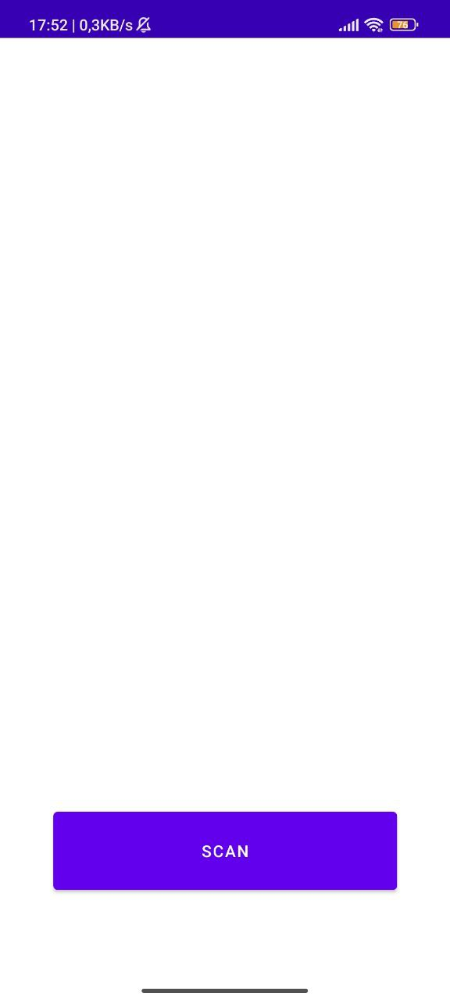
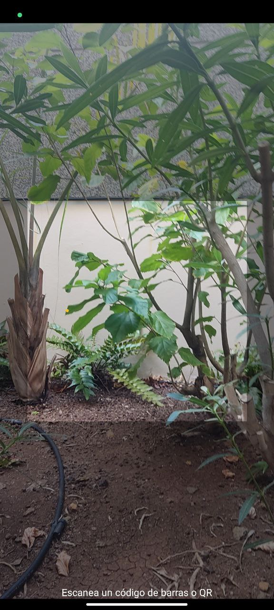

# QR SCANNER

Kotlin QR Scanner is a simple QR code scanning application for [Android](https://www.android.com/) 
originally written in Java and later migrated to Kotlin. 
This app allows users to scan QR codes using their device's camera and extract information from them.

## Table of Contents

1. [Features](#features)
2. [Getting Started](#getting-started)
3. [License](#license)

## Features

- Scan QR codes quickly and accurately. 
- Display the decoded information from scanned QR codes. 
- Minimalistic user interface for ease of use. 
- Migrated from Java to Kotlin for improved maintainability and readability.

## Getting Started

To run this project locally, follow these steps:

1. Clone the repository: `git clone https://github.com/enriqueseor/qr-scanner.git`
2. Open de directory with [Android Studio](https://developer.android.com/studio)
3. Choose a physical or virtual device. 
4. Build and run the project

## License

This project is licensed under the [MIT License](LICENSE).
